## Pytorch训练流程

```mermaid
flowchart TD
    A[PyTorch 训练流程] --> B[数据加载与预处理]
    
    subgraph B [数据加载与预处理]
        B1[本地文件: pd.read_csv]
        B2[Hugging Face: load_dataset]
        B3[数据预处理]
        
        B3 --> B31[处理缺失值]
        B3 --> B32[编码分类变量<br>LabelEncoder]
        B3 --> B33[标准化数值特征<br>StandardScaler]
        B3 --> B34[数据集划分<br>train_test_split]
    end
    
    B --> C[创建PyTorch数据集]
    
    subgraph C [创建PyTorch数据集]
        C1[转换为张量: torch.tensor]
        C2[创建Dataset<br>TensorDataset或自定义Dataset]
        C3[创建DataLoader<br>设置批量大小/是否打乱]
    end
    
    C --> D[定义神经网络模型]
    
    subgraph D [定义神经网络模型]
        D1[继承nn.Module]
        D2[在__init__中定义网络层]
        D3[实现forward方法]
    end
    
    D --> E[设置训练参数]
    
    subgraph E [设置训练参数]
        E1[选择设备: CPU/GPU]
        E2[损失函数:<br>分类:交叉熵<br>回归:均方误差]
        E3[优化器: Adam等]
        E4[学习率调度器]
    end
    
    E --> F[训练循环]
    
    subgraph F [训练循环]
        F1[model.train<br>训练模式]
        F2[从DataLoader迭代批次]
        F3[前向传播: 计算输出]
        F4[计算损失: 比较输出与标签]
        F5[反向传播: loss.backward]
        F6[优化器更新: optimizer.step]
        F7[梯度清零: optimizer.zero_grad]
    end
    
    F --> G[验证与评估]
    
    subgraph G [验证与评估]
        G1[model.eval<br>评估模式]
        G2[禁用梯度: torch.no_grad]
        G3[计算验证损失]
        G4[计算评估指标:<br>准确率/MSE/R²等]
    end
    
    G --> H[结果可视化]
    
    subgraph H [结果可视化]
        H1[损失曲线]
        H2[预测vs真实值]
        H3[混淆矩阵]
    end
    
    H --> I[保存模型]
    
    subgraph I [保存模型]
        I1[保存模型权重]
        I2[保存预处理工具]
        I3[保存模型架构信息]
    end
    
    %% 连接各个主要步骤
    B --> C
    C --> D
    D --> E
    E --> F
    F --> G
    G --> H
    H --> I
    
    
    %% 样式定义
    classDef default fill:#e6f3ff,stroke:#333,stroke-width:1px;
    classDef process fill:#fff6e6,stroke:#333,stroke-width:1px;
    class B1,B2,B31,B32,B33,B34,C1,C2,C3,D1,D2,D3,E1,E2,E3,E4,F1,F2,F3,F4,F5,F6,F7,G1,G2,G3,G4,H1,H2,H3,I1,I2,I3 process;
```





# PyTorch 训练流程关键代码示例

下面是每个步骤的关键代码示例，这些代码片段可以组合成一个完整的 PyTorch 训练流程：

## 1. 数据加载与预处理

```python
import pandas as pd
from datasets import load_dataset
from sklearn.model_selection import train_test_split
from sklearn.preprocessing import StandardScaler, LabelEncoder

# 从本地文件加载数据
df = pd.read_csv('drug200.csv')

# 从Hugging Face加载数据
# dataset = load_dataset("jcalifornia-housing")
# df = pd.DataFrame(dataset['train'])

# 处理缺失值
df = df.dropna()  # 或使用填充 df.fillna(df.mean())

# 编码分类变量
categorical_cols = ['Sex', 'BP', 'Cholesterol']
encoders = {}
for col in categorical_cols:
    le = LabelEncoder()
    df[col] = le.fit_transform(df[col])
    encoders[col] = le

# 标准化数值特征
scaler = StandardScaler()
X = df.drop('Drug', axis=1).values
y = df['Drug'].values
X_scaled = scaler.fit_transform(X)

# 数据集划分
X_train, X_test, y_train, y_test = train_test_split(
    X_scaled, y, test_size=0.2, random_state=42
)
```

## 2. 创建 PyTorch 数据集

```python
import torch
from torch.utils.data import TensorDataset, DataLoader

# 转换为张量
X_train_tensor = torch.tensor(X_train, dtype=torch.float32)
y_train_tensor = torch.tensor(y_train, dtype=torch.long)
X_test_tensor = torch.tensor(X_test, dtype=torch.float32)
y_test_tensor = torch.tensor(y_test, dtype=torch.long)

# 创建Dataset
train_dataset = TensorDataset(X_train_tensor, y_train_tensor)
test_dataset = TensorDataset(X_test_tensor, y_test_tensor)

# 创建DataLoader
batch_size = 32
train_loader = DataLoader(
    train_dataset, 
    batch_size=batch_size, 
    shuffle=True,
    num_workers=2
)
test_loader = DataLoader(
    test_dataset, 
    batch_size=batch_size, 
    shuffle=False,
    num_workers=2
)
```

## 3. 定义神经网络模型

```python
import torch.nn as nn

class DrugClassifier(nn.Module):
    def __init__(self, input_size, num_classes):
        super(DrugClassifier, self).__init__()
        self.fc1 = nn.Linear(input_size, 128)
        self.relu1 = nn.ReLU()
        self.dropout1 = nn.Dropout(0.3)
        
        self.fc2 = nn.Linear(128, 64)
        self.relu2 = nn.ReLU()
        self.dropout2 = nn.Dropout(0.3)
        
        self.fc3 = nn.Linear(64, num_classes)
    
    def forward(self, x):
        x = self.dropout1(self.relu1(self.fc1(x)))
        x = self.dropout2(self.relu2(self.fc2(x)))
        x = self.fc3(x)
        return x

# 初始化模型
input_size = X_train.shape[1]
num_classes = len(np.unique(y))
model = DrugClassifier(input_size, num_classes)
```

## 4. 设置训练参数

```python
# 选择设备
device = torch.device("cuda" if torch.cuda.is_available() else "cpu")
model = model.to(device)

# 损失函数
criterion = nn.CrossEntropyLoss()  # 分类任务
# criterion = nn.MSELoss()  # 回归任务

# 优化器
optimizer = optim.Adam(model.parameters(), lr=0.001)

# 学习率调度器
scheduler = optim.lr_scheduler.ReduceLROnPlateau(
    optimizer, mode='min', factor=0.1, patience=5, verbose=True
)
```

## 5. 训练循环

```python
num_epochs = 100
train_losses = []

for epoch in range(num_epochs):
    model.train()  # 训练模式
    running_loss = 0.0
    
    for inputs, labels in train_loader:
        inputs, labels = inputs.to(device), labels.to(device)
        
        # 前向传播
        outputs = model(inputs)
        loss = criterion(outputs, labels)
        
        # 反向传播和优化
        optimizer.zero_grad()
        loss.backward()
        optimizer.step()
        
        running_loss += loss.item() * inputs.size(0)
    
    # 计算平均训练损失
    epoch_loss = running_loss / len(train_loader.dataset)
    train_losses.append(epoch_loss)
    
    print(f'Epoch [{epoch+1}/{num_epochs}], Loss: {epoch_loss:.4f}')
```

## 6. 验证与评估

```python
model.eval()  # 评估模式
test_loss = 0.0
correct = 0
total = 0

with torch.no_grad():  # 禁用梯度
    for inputs, labels in test_loader:
        inputs, labels = inputs.to(device), labels.to(device)
        outputs = model(inputs)
        
        # 计算损失
        loss = criterion(outputs, labels)
        test_loss += loss.item() * inputs.size(0)
        
        # 计算准确率
        _, predicted = torch.max(outputs.data, 1)
        total += labels.size(0)
        correct += (predicted == labels).sum().item()

# 计算评估指标
test_loss /= len(test_loader.dataset)
accuracy = correct / total

print(f'Test Loss: {test_loss:.4f}, Accuracy: {accuracy:.4f}')
```

## 7. 结果可视化

```python
import matplotlib.pyplot as plt
from sklearn.metrics import confusion_matrix
import seaborn as sns

# 绘制损失曲线
plt.figure(figsize=(10, 5))
plt.plot(train_losses, label='Training Loss')
plt.xlabel('Epochs')
plt.ylabel('Loss')
plt.title('Training Loss')
plt.legend()
plt.show()

# 绘制混淆矩阵
all_preds = []
all_labels = []
with torch.no_grad():
    for inputs, labels in test_loader:
        inputs = inputs.to(device)
        outputs = model(inputs)
        _, preds = torch.max(outputs, 1)
        all_preds.extend(preds.cpu().numpy())
        all_labels.extend(labels.cpu().numpy())

cm = confusion_matrix(all_labels, all_preds)
plt.figure(figsize=(10, 8))
sns.heatmap(cm, annot=True, fmt='d', cmap='Blues')
plt.xlabel('Predicted')
plt.ylabel('True')
plt.title('Confusion Matrix')
plt.show()
```

## 8. 保存模型

```python
# 保存模型权重
torch.save(model.state_dict(), 'drug_classifier.pth')

# 保存整个模型（包含架构）
torch.save({
    'model_state_dict': model.state_dict(),
    'scaler': scaler,
    'encoders': encoders,
    'label_encoder': label_encoder,
    'input_size': input_size,
    'num_classes': num_classes
}, 'full_model.pth')

# 加载模型示例
model = DrugClassifier(input_size, num_classes)
model.load_state_dict(torch.load('drug_classifier.pth'))
model.eval()
```

