/ bnjm

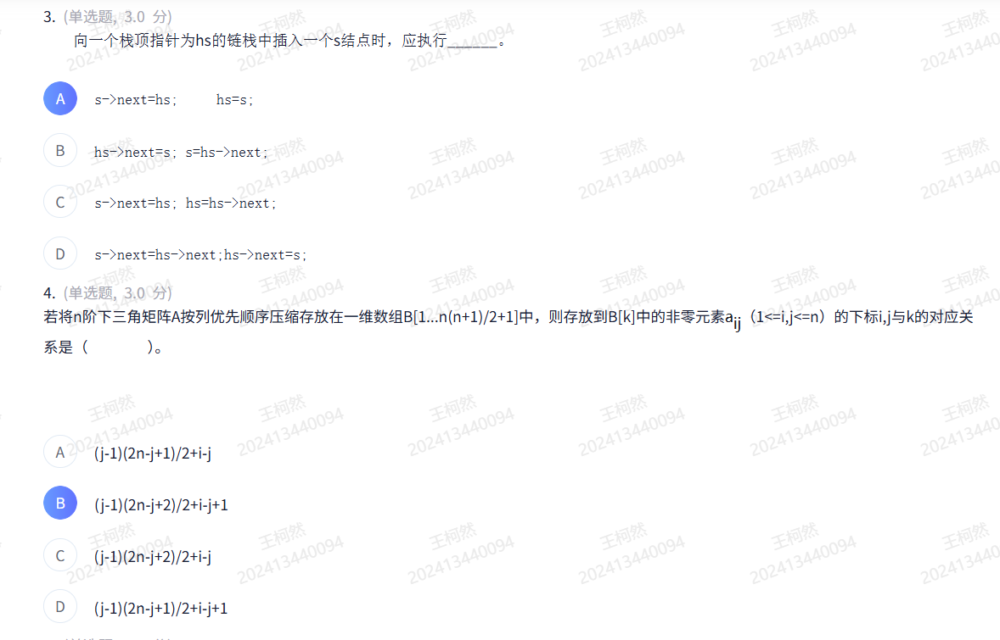

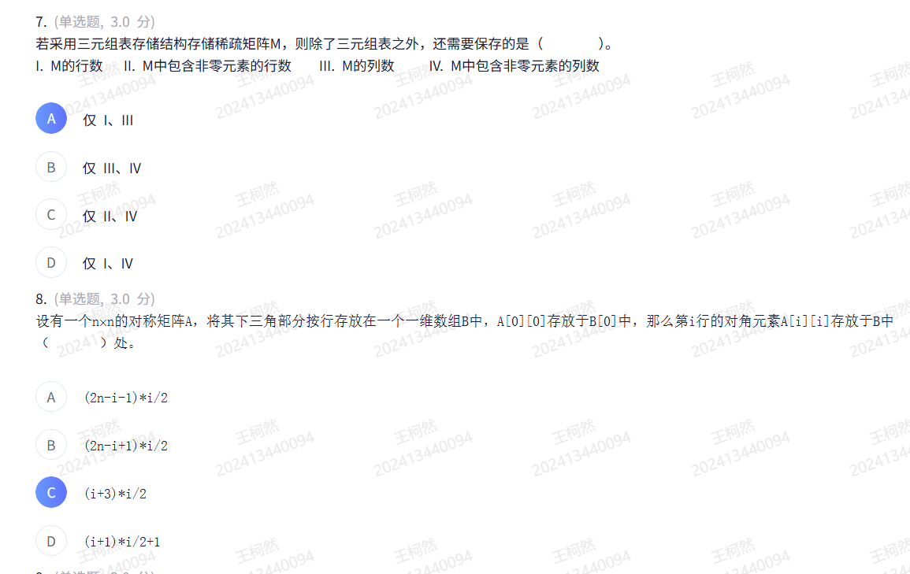
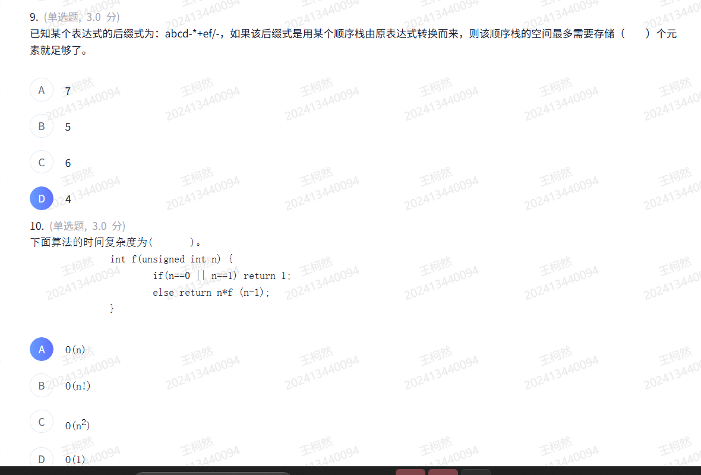
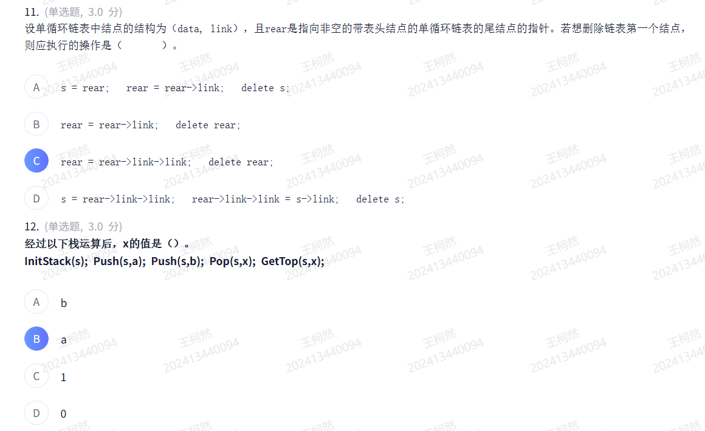
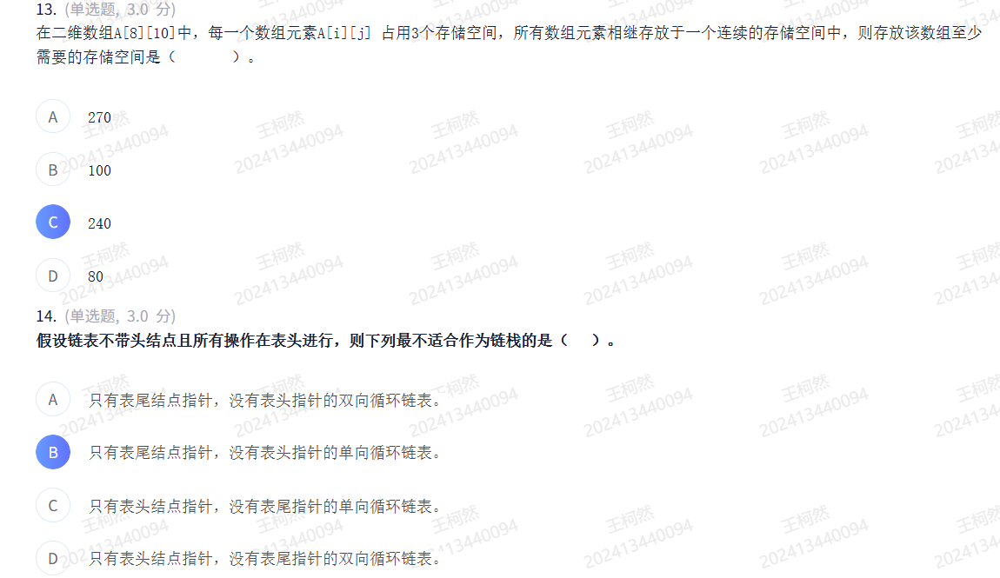
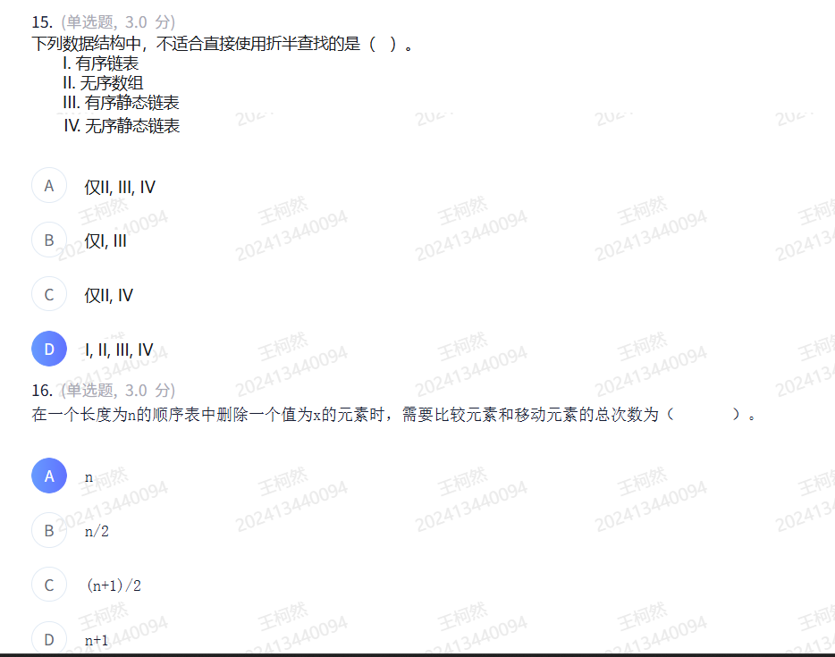
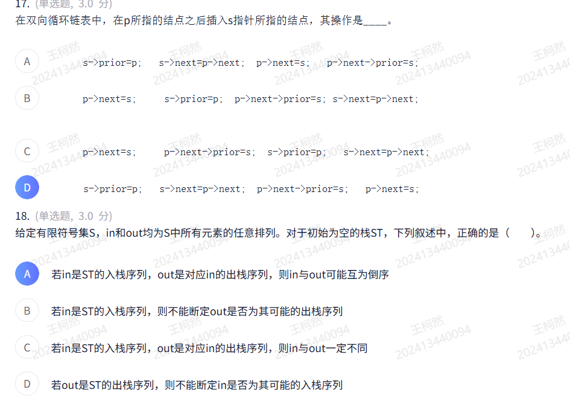
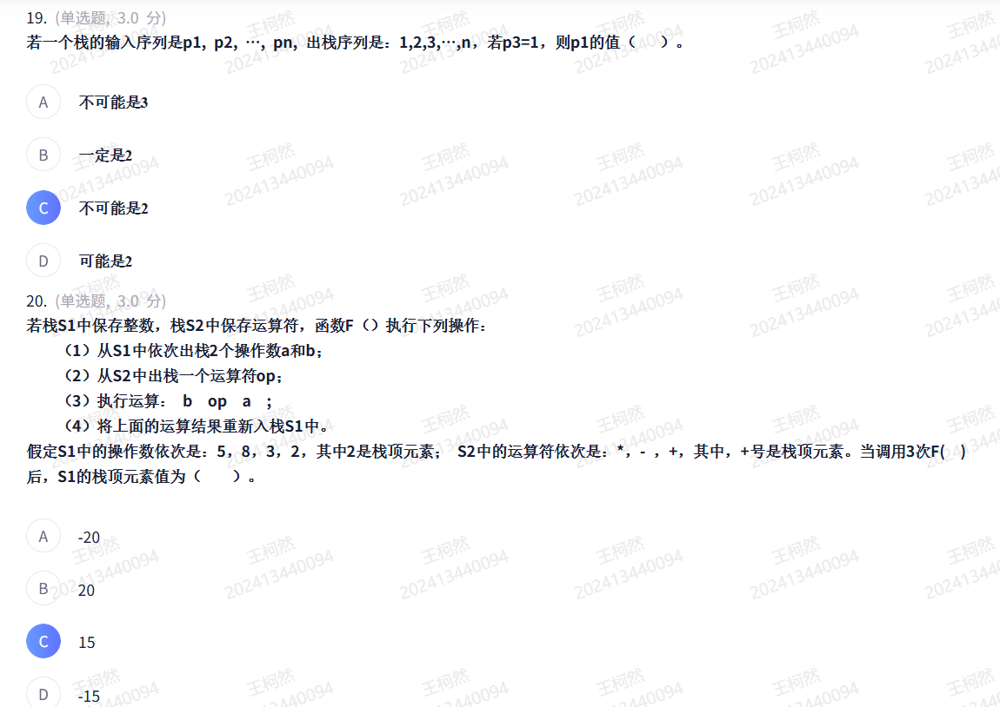
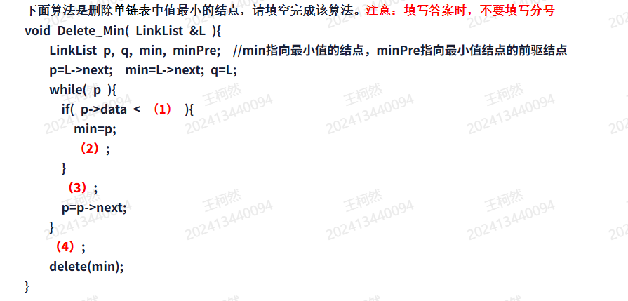
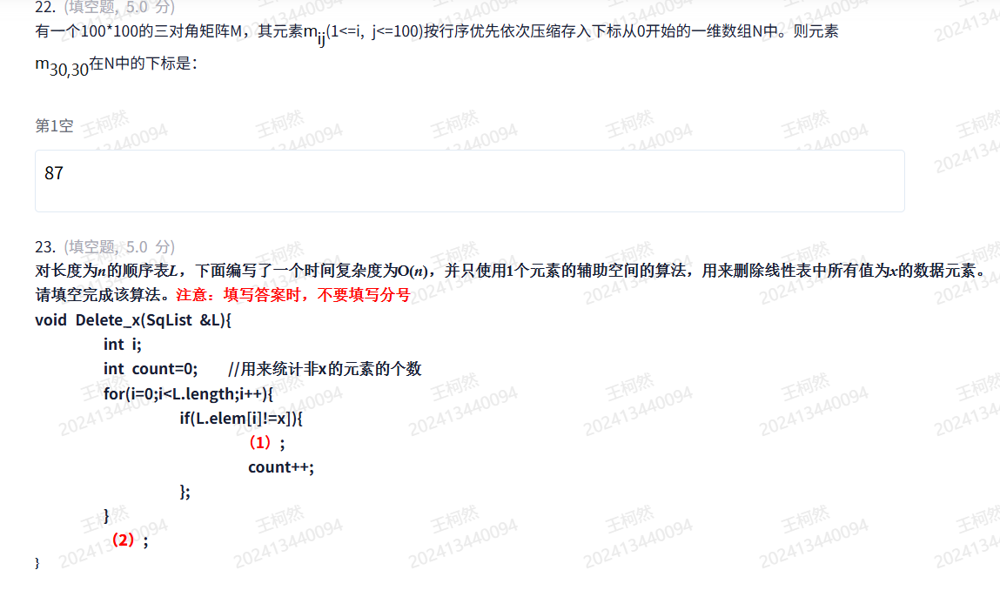
23.
(1) `L.elem[count] = L.elem[i]`
(2)`L.length = count`
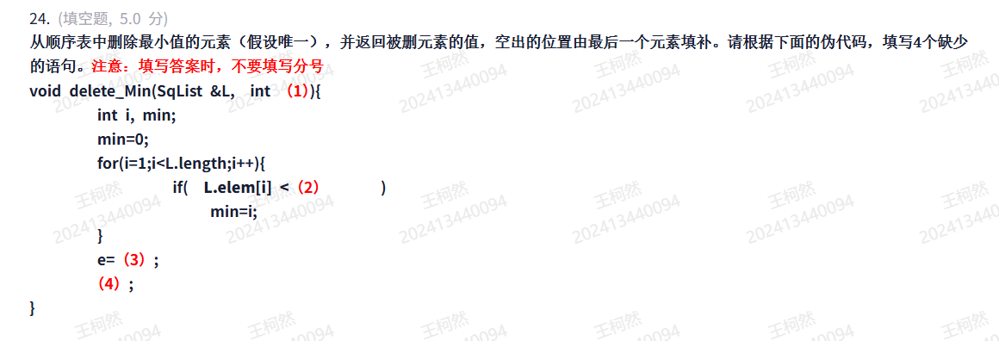
(1)`&e`
(2)`L.elem[min]`
(3)`L.elem[min]`
(4)`L.elem[min]=L.elem[--L.length]`
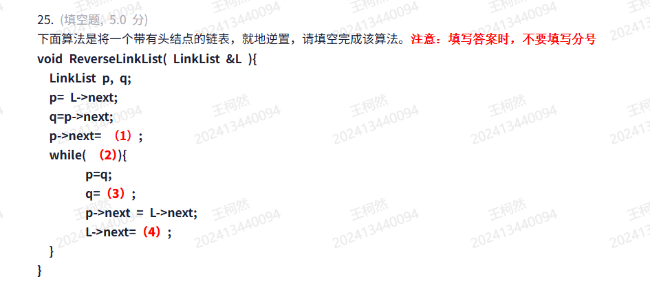
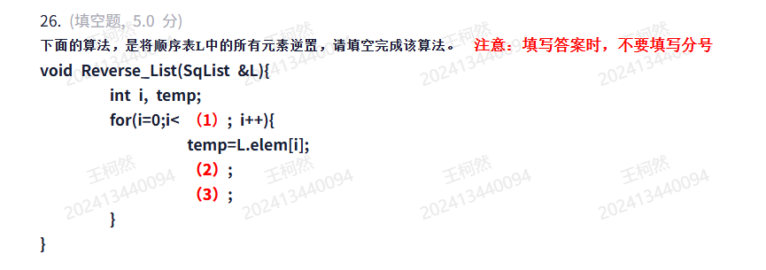
(1)`L.length/2`
(2)`L.elem[i]=L.elem[L.length-1-i]`
(3)`L.elem[L.length-1-i]=temp`
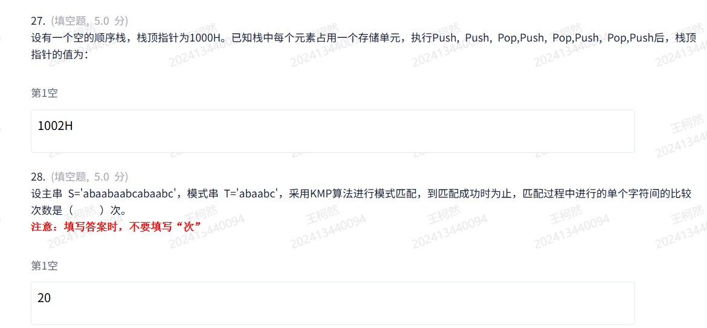
