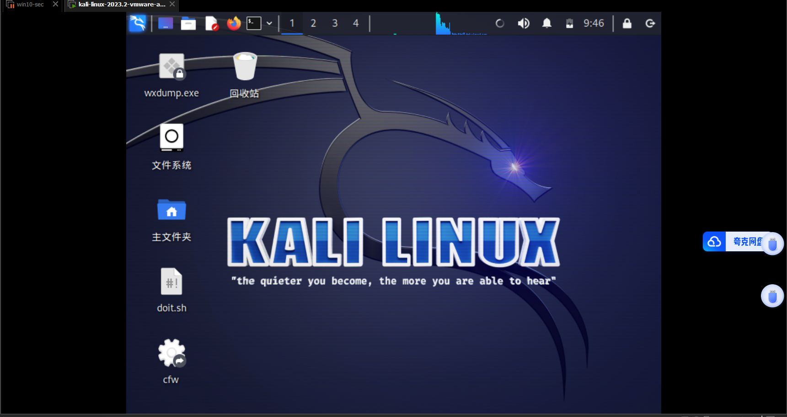

#网络安全

## Obsidian的使用

[链接](#链接)
### 标题
```js
## 二级标题
### 三级标题
```

### 代码块

```C
多行的代码块 就用三个`
单行代码块就用 一个`
```

`单行代码块`


### 列表
- [有序列表](#有序列表)
- [无序列表](#无序列表)

```js
有序号列表：1. xxxx
无序号列表：- xxxx
回车 + tab（小列表）
```
#### 有序列表
1. aaaaaaaaa
2. bbbbbbbbb
3. vvvvvvvvvv
	1. ddddd
	2. ssssss
4. xxxxxx


#### 无序列表
- aaaa
- vbbbb
	- xxxx
- vvvvvvv

### 引用（前言）
> 大于号就是引用，可以写名人名言，或者全文概述

### 链接
```js
[显示出来的话](#标题名称)

```




## 虚拟机的使用
### ssh远程连接

1. 查找IP地址
	1. 输入`ifconfig`
	2. 找`eth0  --> inet` 
2. 在termius中输入IP地址
3. 如果连接失败，在kali中输入 sudo service ssh start


